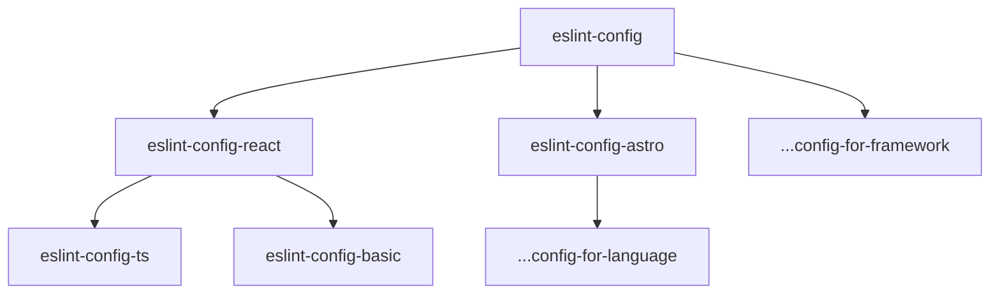

# `@j10c/eslint-config`

- Double quotes, with semi
- No trailing space
- Auto fix for formatting (aimed to be used standalone without Prettier)
- Reasonable defaults, best practices, only one-line of config

## Installation

```sh
$ pnpm i -D @j10c/eslint-config
```

## Usage

Create an `.eslintrc` file:

```js
{
  "extends": ["@j10c"]
}
```

Or add the ESLint config to your `package.json`:

```js
{
  "name": "my-project",
  "eslintConfig": {
    "extends": "@j10c"
  }
}
```

## Configuration Relationship

In this monorepo, those configurations are composed by following the sequence like `eslint-config -> [framework] -> [language]`


